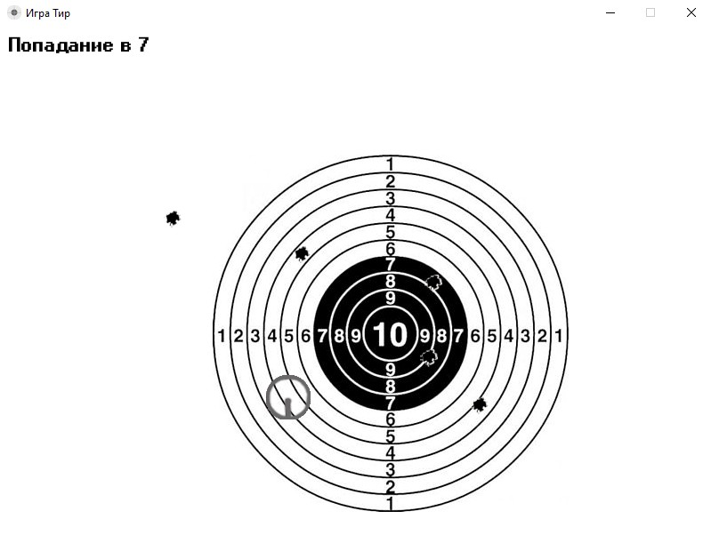

# Lesson3.3

## Игра "Тир"

Эта игра создана на базе урока OG03 курса 
"Программист на **Pyton** с нуля с помощью **ChatGPT**"
 в Университете Зерокодинг.

Реализация программы выполнене с помощью *ChatGPT* и 
функционала модуля *pygame*. Изображения мишени и 
пулевых отверстий найдены в Интернете.

Процесс игры состоит в том, что пользователь кликом 
мышки наносит на движущуюся мишень пулевые отверстия.
Программа расчитывает величину отклонения отверстия 
от центра мишени и прорисовывает каждое попадание
на игровом поле поверх изображения мишени. В верхней
зоне игрового поля пишется результат последнего выстрела.

 

